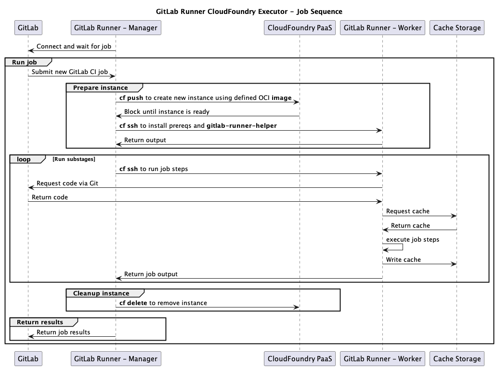

# gitlab-runner-cloudgov
Code for running GitLab CI/CD jobs on cloud.gov or another CloudFoundry based
PaaS.

## How it works

This is a custom executor borrowing ideas from https://docs.gitlab.com/runner/executors/custom.html.

It runs a "manager" GitLab Runner instance responsible for listening for new
jobs. Each job is run on a new application instance in CloudFoundry using the
specified OCI image.



The runner manager registration and other flow details are shown
in [Runner Execution Flow](https://gitlab.com/gitlab-org/gitlab-runner/-/tree/main/docs?ref_type=heads#runner-execution-flow).

## Deploying

1. Log in to cloud.gov
    ```
    cf login -a api.fr.cloud.gov --sso
    ```

2. Target the org and space for deployment
    ```
    cf target -o ORGNAME -s SPACENAME
    ```
    For example:
    ```
    cf target -o sandbox-gsa -s bret.mogilefsky
    ```

3. Create a [cloud.gov service account](https://cloud.gov/docs/services/cloud-gov-service-account/), tagged with `gitlab-service-account`
    ```
    cf create-service cloud-gov-service-account space-deployer SERVICE_ACCOUNT_INSTANCE -t "gitlab-service-account"
    ```

4. Create a [cloud.gov brokered S3 bucket](https://cloud.gov/docs/services/s3/) - `basic-sandbox` is suggested.
   Note that `OBJECT_STORE_INSTANCE` only needs to be unique within the specific space as it will have a prefix prepended to create the S3 bucket name.
    ```
    cf create-service s3 basic-sandbox OBJECT_STORE_INSTANCE
    ```

4. Copy `vars.yml-template` to `vars.yml`
    ```
    cp vars.yml-template vars.yml
    ```

5. Edit `vars.yml` and modify the values there as needed. In particular, you must 
    * supply the `ci_server_token` provided when you [configure the runner at the target GitLab URL](https://docs.gitlab.com/ee/tutorials/create_register_first_runner/#create-and-register-a-project-runner)
    * supply the `service_account_instance` name that you used when you created the service instance in step 3
    * supply the `object_store_instance` name that you used when you created the brokered S3 bucket in step 4

6. Deploy the GitLab runner
    ```
    cf push --vars-file vars.yml
    ```
7. Check to see that the runner has registered itself in GitLab under your project
   repository under Settings -> CI/CD -> Runners (Expand)

At this point the runner should be available to run jobs. See [Use GitLab - Use CI/CD to build your application - Getting started](https://docs.gitlab.com/ee/ci/)
for much more on GitLab CI/CD and runners.

## TODO

- Make it possible to run DAST/a11y/other tests requiring a running copy of the
  application and a separate scanning process.
- Set custom executor timeouts based on measurements.
- Add linting and tests.
- Improve documentation.
- Add support for RedHat based images in `prepare.sh`.
- Add version pinning and support for other architectures to `gitlab-runner-helper`
  installation in `prepare.sh`.

## Design Decisions

### Use environment variables to register gitlab-runner

Recent versions of `gitlab-runner` expose almost all initial configuration
variables for the `register` subcommand as environment variables. This allows
us to do almost all configuration in `manifest.yml` and skip modifying
command line options in `runner/.profile` or having a .toml add on.
