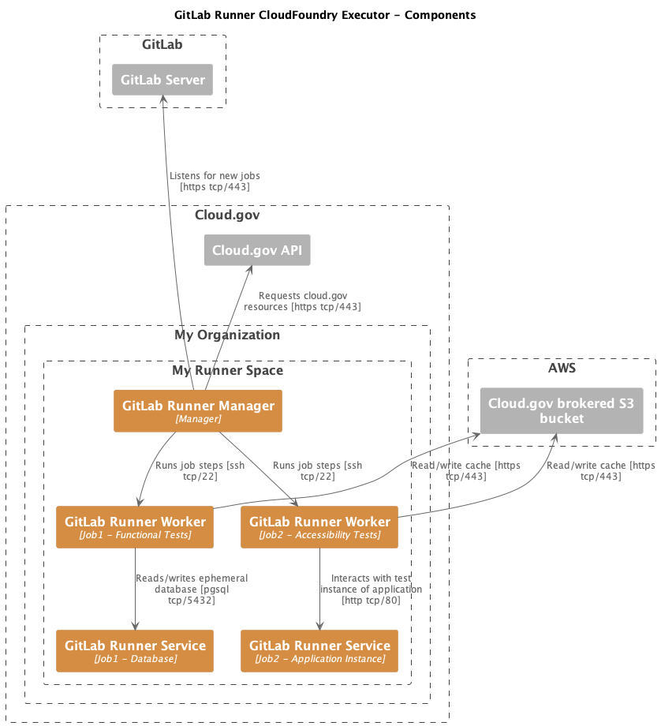

# gitlab-runner-cloudgov
Code for running GitLab CI/CD jobs on cloud.gov or another CloudFoundry based
PaaS.


* [Differences from other GitLab Runner executor types](#differences-from-other-gitlab-runner-executor-types)
* [How it works](#how-it-works)
* [Deploying](#deploying)
* [Troubleshooting](#troubleshooting)
* [Design Decisions](#design-decisions)


## Differences from other GitLab Runner executor types

The goal of this runner executor is to support most CI/CD use cases without
needing to modify your `.gitlab-ci.yml`. Please note the current limitiations
and differences in comparison to the Docker executor:

* __No shared filesystem or direct exec capability__ - Some
  executors can share filesystems between containers and directly execute processes
  in containers. CloudFoundry does not support sharing filesystems and only supports
  use of SSH to execute into a running container. This runner attempts to transparently
  work around these limitations where possible. Your CI job may require significant
  modification if it relies on either of these features.
* __Use CI_SERVICE_alias for service DNS names__ - Ephemeral networks like the Docker networks
  used for the Docker executor are not available in CloudFoundry. This means
  that each service you create lives in a common internal DNS namespace with
  other services in the same CloudFoundry space. The cloud.gov runner populates
  a `CI_SERCVCE_<alias>` variable for each service defined in a job. Here is an
  example snippet of GitLab CI Yaml showing the definition of a service and how
  the job steps can then connect to that service:
  ~~~yaml
  # Start a HTTP "echo" service and then send a request to it
  echo-test-job:
    stage: test
    image: ubuntu:jammy
  services:
  - name: http-https-echo:latest
    # Note "echo" is the alias name, so the CI_SERVICE_alias variable key name
    # for this service is CI_SERVICE_echo
    alias: echo
  script:
  # Using the CI_SERVICE_alias to provide the FQDN of the service
  - curl http://${CI_SERVICE_echo}:8080
  ~~~

## How it works

This is a custom executor borrowing ideas from https://docs.gitlab.com/runner/executors/custom.html.

It runs a "manager" GitLab Runner instance responsible for listening for new
jobs. Each job is run on a new application instance in CloudFoundry using the
specified OCI image.


__[source](doc/gitlab-runner-cf-driver-components.pu)__

The relevant components of the solution are shown above with two running stages.
* "GitLab Runner - Manager" - This is the persistent application defined in this
  very repository. It registers with the GitLab instance and waits for further
  instructions.
* "GitLab Runner - Worker" - The manager starts worker application instances
  using the container image you specify and runs job steps via CloudFoundry
  `cf ssh` calls into the running containers.
* "GitLab Runner - Service" - Optional service instances can be started for use
  by the Worker instances. These run as separate apps using the container
  image you specify.


__[source](doc/gitlab-runner-cf-sequence-overview.pu)__

The above sequence diagram illustrates the series of events in a given job run.
Optional service lifecycles are not shown, but run as part of the `prepare` phase.

The runner manager registration and other flow details are shown
in [Runner Execution Flow](https://gitlab.com/gitlab-org/gitlab-runner/-/tree/main/docs?ref_type=heads#runner-execution-flow).

## Deploying

1. Log in to cloud.gov
    ```
    cf login -a api.fr.cloud.gov --sso
    ```

2. Target the org and space for deployment
    ```
    cf target -o ORGNAME -s SPACENAME
    ```
    For example:
    ```
    cf target -o sandbox-gsa -s bret.mogilefsky
    ```

3. Create a [cloud.gov service account](https://cloud.gov/docs/services/cloud-gov-service-account/), tagged with `gitlab-service-account`
    ```
    cf create-service cloud-gov-service-account space-deployer SERVICE_ACCOUNT_INSTANCE -t "gitlab-service-account"
    ```

4. Create a [cloud.gov brokered S3 bucket](https://cloud.gov/docs/services/s3/) - `basic-sandbox` is suggested.
   Note that `OBJECT_STORE_INSTANCE` only needs to be unique within the specific space as it will have a prefix prepended to create the S3 bucket name.
    ```
    cf create-service s3 basic-sandbox OBJECT_STORE_INSTANCE
    ```

4. Copy `vars.yml-template` to `vars.yml`
    ```
    cp vars.yml-template vars.yml
    ```

5. Edit `vars.yml` and modify the values there as needed. In particular, you must 
    * supply the `ci_server_token` provided when you [configure the runner at the target GitLab URL](https://docs.gitlab.com/ee/tutorials/create_register_first_runner/#create-and-register-a-project-runner)
    * supply the `service_account_instance` name that you used when you created the service instance in step 3
    * supply the `object_store_instance` name that you used when you created the brokered S3 bucket in step 4

6. Deploy the GitLab runner
    ```
    cf push --vars-file vars.yml
    ```
7. Check to see that the runner has registered itself in GitLab under your project
   repository under Settings -> CI/CD -> Runners (Expand)

At this point the runner should be available to run jobs. See [Use GitLab - Use CI/CD to build your application - Getting started](https://docs.gitlab.com/ee/ci/)
for much more on GitLab CI/CD and runners.

## Troubleshooting

### Viewing manager instance logs

Problems with runner registration often requiring viewing it's logs.

~~~
cf logs --recent RUNNER-NAME
~~~

### "Request error: Get https://API-URL/v2/info: dial tcp X.X.X.X:443: connect: connection refused"

The GitLab Runner manager needs to contact the CloudFoundry API to schedule
runner applications. This indicates your CloudFoundry space security group may
be too restrictive or not set.

For a production deployment you should use tightly controlled egress filtering,
ideally with a name based proxy.

Test Only - For a basic test environment with no privileged access you can use
the following to apply a loose egress security group policy on cloud.gov:

~~~
cf bind-security-group public_networks_egress ORG_NAME --space SPACE_NAME
~~~

## TODO

- Make it possible to run DAST/a11y/other tests requiring a running copy of the
  application and a separate scanning process.
- Set custom executor timeouts based on measurements.
- Add linting and tests.
- Improve documentation.
- Add support for RedHat based images in `prepare.sh`.
- Add version pinning and support for other architectures to `gitlab-runner-helper`
  installation in `prepare.sh`.

## Design Decisions

### Use environment variables to register gitlab-runner

Recent versions of `gitlab-runner` expose almost all initial configuration
variables for the `register` subcommand as environment variables. This allows
us to do almost all configuration in `manifest.yml` and skip modifying
command line options in `runner/.profile` or having a .toml add on.
